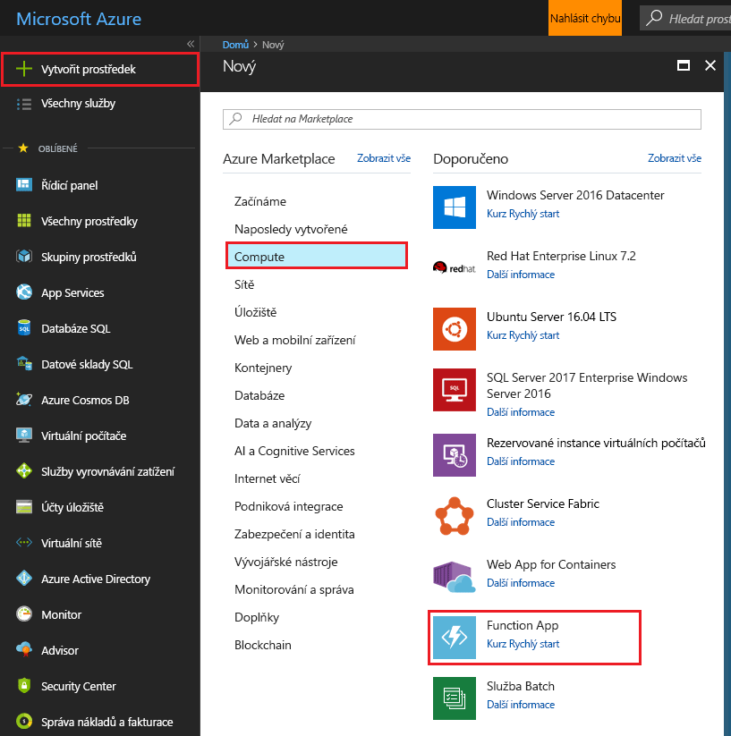
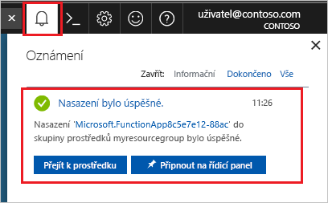

1. Klikněte na tlačítko **Nový** v levém horním rohu portálu Azure Portal a pak vyberte **Compute** > **Function App**. 

    

2. Použijte nastavení aplikace Function App uvedená v tabulce pod obrázkem.

    

    | Nastavení      | Navrhovaná hodnota  | Popis                                        |
    | ------------ |  ------- | -------------------------------------------------- |
    | **Název aplikace** | Globálně jedinečný název | Název identifikující novou aplikaci Function App. Platné znaky jsou `a-z`, `0-9` a `-`.  | 
    | **Předplatné** | Vaše předplatné | Předplatné, pod kterým je tato nová aplikace Function App vytvořena. | 
    | **[Skupina prostředků](../articles/azure-resource-manager/resource-group-overview.md)** |  myResourceGroup | Název nové skupiny prostředků, ve které chcete vytvořit aplikaci Function App. | 
    | **OS** | Windows | Hostování bez serveru je momentálně dostupné jenom při spuštění ve Windows. Informace k hostování na Linuxu najdete v tématu [Vytvoření první funkce spuštěné v Linuxu pomocí Azure CLI](../articles/azure-functions/functions-create-first-azure-function-azure-cli-linux.md). |
    | **[Plán hostování](../articles/azure-functions/functions-scale.md)** | Plán Consumption | Plán hostování, který určuje způsob přidělování prostředků aplikaci Function App. Ve výchozím **plánu Consumption** se prostředky přidávají dynamicky podle požadavků příslušných funkcí. U tohoto hostování [bez serveru](https://azure.microsoft.com/overview/serverless-computing/) platíte jenom za dobu, kdy jsou funkce spuštěné. Pokud používáte plán služby App Service, musíte zajistit správu [škálování vaší aplikace funkcí](../articles/azure-functions/functions-scale.md).  |
    | **Umístění** | Západní Evropa | Vyberte [oblast](https://azure.microsoft.com/regions/) ve své blízkosti nebo v blízkosti jiných služeb, které vaše funkce využívají. |
    | **[Účet úložiště](../articles/storage/common/storage-quickstart-create-account.md)** |  Globálně jedinečný název |  Název nového účtu úložiště, který bude aplikace Function App používat. Názvy účtů úložiště musí mít délku 3 až 24 znaků a můžou obsahovat jenom číslice a malá písmena. Můžete použít také existující účet, který splňuje [požadavky na účet úložiště](../articles/azure-functions/functions-scale.md#storage-account-requirements). |

3. Aplikaci Function App zřídíte a nasadíte kliknutím na **Vytvořit**.

4. Vyberte ikonu oznámení v pravém horním rohu portálu a sledujte, kdy se objeví zpráva, že **nasazení bylo úspěšné**. 

    

5. Volbou **Přejít k prostředku** novou aplikaci Function App zobrazíte.

> [!TIP]
> Pokud máte potíže najít na portálu své aplikace funkcí, zkuste [přidat aplikace funkcí mezi oblíbené na webu Azure Portal](../articles/azure-functions/functions-how-to-use-azure-function-app-settings.md#favorite).   
