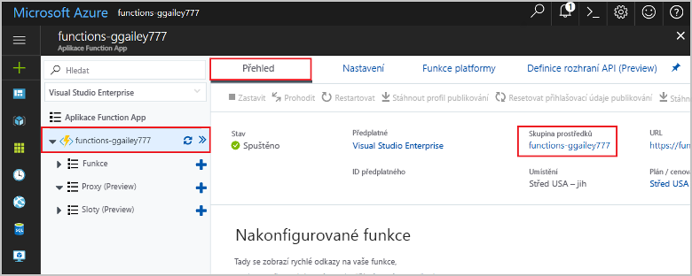

1. Na webu Azure Portal přejděte na stránku **Skupina prostředků**. 

   Pokud se na tuto stránku chcete dostat ze stránky aplikace funkcí, vyberte kartu **Přehled** a potom vyberte odkaz pod nadpisem **Skupina prostředků**.

   

   Pokud se na tuto stránku chcete dostat z řídicího panelu, vyberte **skupiny prostředků** a pak vyberte skupinu prostředků, kterou jste použili v tomto článku.

2. Na stránce **Skupina prostředků** zkontrolujte seznam zahrnutých prostředků a ověřte, že se jedná o ty, které chcete odstranit.
 
3. Vyberte **Odstranit skupinu prostředků** a postupujte podle pokynů.

   Odstranění může trvat několik minut. Po jeho dokončení se na několik sekund zobrazí oznámení. K zobrazení tohoto oznámení můžete také vybrat ikonu zvonku v horní části stránky.