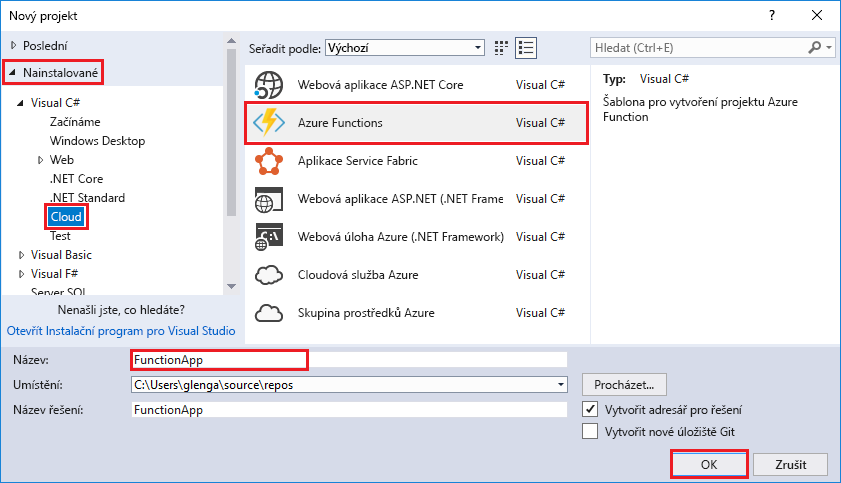
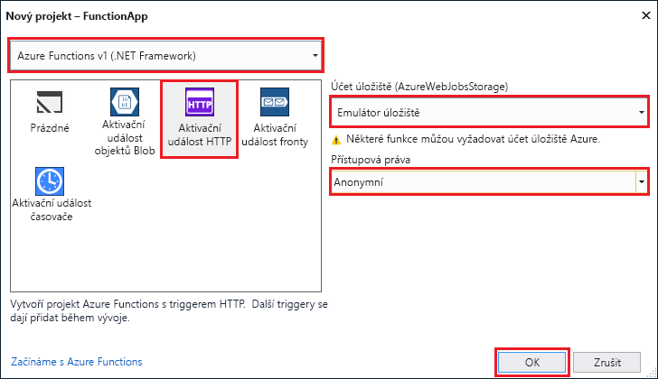

Šablona projektu Azure Functions v sadě Visual Studio vytvoří projekt, který jde publikovat do aplikace funkcí v Azure. Aplikace funkcí umožňuje seskupit funkce jako logickou jednotku pro snadnější správu, nasazování a sdílení prostředků.

1. V sadě Visual Studio zvolte v nabídce **Soubor** možnost **Nový** > **Projekt**.

2. V dialogovém okně **Nový projekt** vyberte **Nainstalované**, rozbalte uzel **Visual C#** > **Cloud**, vyberte **Azure Functions**, zadejte **název** vašeho projektu a klikněte na **OK**. Název aplikace funkcí musí být platný jako obor názvů C#, takže nepoužívejte podtržítka, pomlčky nebo jiné nealfanumerické znaky.

    

3. Použijte nastavení uvedená v tabulce pod obrázkem.

     

    | Nastavení      | Navrhovaná hodnota  | Popis                      |
    | ------------ |  ------- |----------------------------------------- |
    | **Verze** | Azure Functions v1  (.NET Framework) | Vytvoří se projekt funkce, který používá modul runtime Azure Functions verze 1. Modul runtime verze 2, který podporuje .NET Core, je teď ve verzi Preview. Další informace najdete v tématu s [přehledem verzí modulu runtime Azure Functions](../articles/azure-functions/functions-versions.md).   |
    | **Šablona** | Trigger HTTP | Vytvoří se funkce, kterou aktivuje požadavek HTTP. |
    | **Účet úložiště**  | Emulátor úložiště | Trigger HTTP nepoužívá připojení účtu úložiště. Všechny ostatní typy triggerů vyžadují platný připojovací řetězec účtu úložiště. |
    | **Přístupová práva** | Anonymní | Vytvořenou funkci může aktivovat libovolný klient bez zadání klíče. Toto nastavení autorizace usnadňuje testování nových funkcí. Další informace o klíčích a autorizace najdete v části věnovaném [klíčům autorizace](../articles/azure-functions/functions-bindings-http-webhook.md#authorization-keys) v tématu [HTTP a webhookové vazby](../articles/azure-functions/functions-bindings-http-webhook.md). |
4. Kliknutím na **OK** vytvoříte projekt funkce a funkci aktivovanou HTTP.

