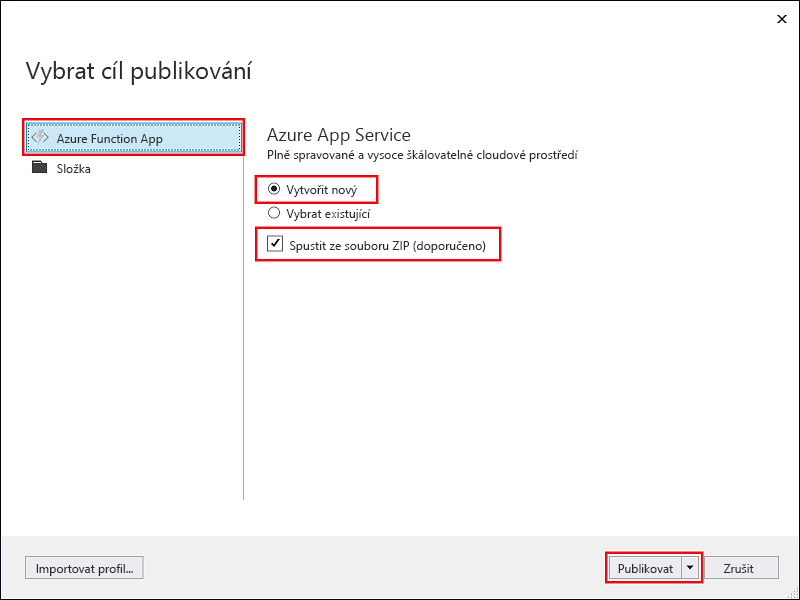
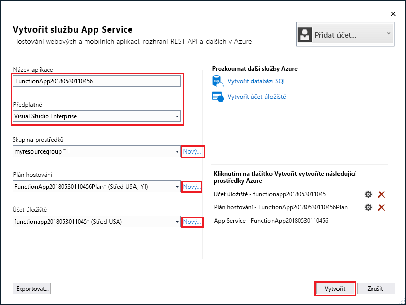
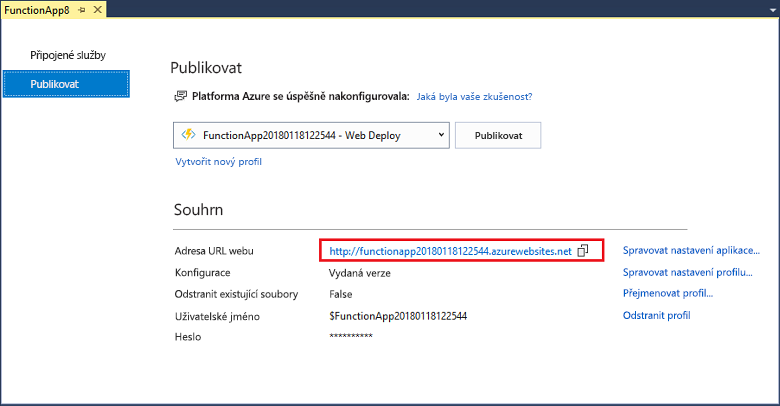

1. V **Průzkumníku řešení** klikněte pravým tlačítkem na požadovaný projekt a vyberte **Publikovat**.

2. Vyberte **Aplikace Azure Function**, zvolte **Vytvořit novou** a potom vyberte **Publikovat**.

    

2. Pokud jste ještě nepřipojili Visual Studio k účtu Azure, vyberte **Přidat účet...** .

3. V dialogovém okně **Vytvořit App Service** použijte nastavení **Hostování** podle tabulky pod obrázkem:

    

    | Nastavení      | Navrhovaná hodnota  | Popis                                |
    | ------------ |  ------- | -------------------------------------------------- |
    | **Název aplikace** | Globálně jedinečný název | Název jednoznačně identifikující novou aplikaci funkcí. |
    | **Předplatné** | Vaše předplatné | Předplatné Azure, které se má použít. |
    | **[Skupina prostředků](../articles/azure-resource-manager/resource-group-overview.md)** | myResourceGroup |  Název skupiny prostředků, ve které chcete vytvořit aplikaci funkcí. Pokud chcete vytvořit novou skupinu prostředků, zvolte **Nová**.|
    | **[Plán služby App Service](../articles/azure-functions/functions-scale.md)** | Plán Consumption | Po vytvoření nového plánu kliknutím na **Nový** nezapomeňte vybrat **Spotřeba** v části **Velikost**. Zvolte také [umístění](https://azure.microsoft.com/regions/) v **oblasti** ve své blízkosti nebo v blízkosti jiných služeb, které vaše funkce využívají.  |
    | **[Účet úložiště](../articles/storage/common/storage-create-storage-account.md#create-a-storage-account)** | Účet úložiště pro obecné účely | Modul runtime Functions vyžaduje účet úložiště Azure. Kliknutím na **Nový** vytvořte účet úložiště pro obecné účely, nebo použijte už existující účet.  |

4. Kliknutím na **Vytvořit** vytvořte aplikaci funkce a související prostředky v Azure a nasaďte kód projektu funkce. 

5. Jakmile se nasazení dokončí, poznamenejte si hodnotu **Adresa URL webu**. Je to adresa vaší aplikace funkcí v Azure.

    
