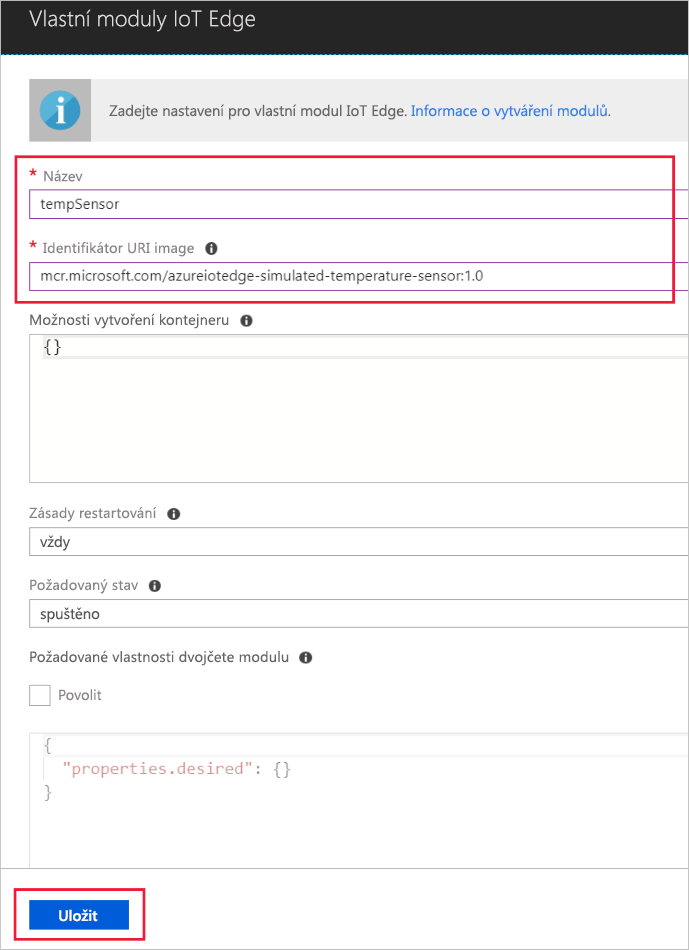

Jednou z klíčových možností služby Azure IoT Edge je schopnost nasazovat moduly do zařízení IoT Edge z cloudu. Modul IoT Edge je spustitelný balíček implementovaný jako kontejner. V této části nasadíte modul, který generuje telemetrická data pro vaše simulované zařízení. 

1. Na webu Azure Portal přejděte do svého centra IoT.
1. Přejděte na **IoT Edge (preview)** a vyberte zařízení IoT Edge.
1. Vyberte **Nastavit moduly**.
1. Vyberte **Přidat modul IoT Edge**.
1. Do pole **Název** zadejte `tempSensor`. 
1. Do pole **Identifikátor URI image** zadejte `microsoft/azureiotedge-simulated-temperature-sensor:1.0-preview`. 
1. Ostatní nastavení ponechte beze změny a vyberte **Uložit**.

   

1. Zpět v kroku **přidání modulů** vyberte **Next** (Další).
1. V kroku **určení tras** vyberte **Next** (Další).
1. V kroku **kontroly šablony** vyberte **Submit** (Odeslat).
1. Vraťte se na obrazovku podrobností o zařízení a zvolte **Refresh** (Obnovit). Měli byste vidět nový modul tempSensor spuštěný společně s modulem runtime IoT Edge. 

   ![Zobrazení modulu tempSensor v seznamu nasazených modulů][1]

<!-- Images -->
[1]: ../articles/iot-edge/media/tutorial-simulate-device-windows/view-module.png