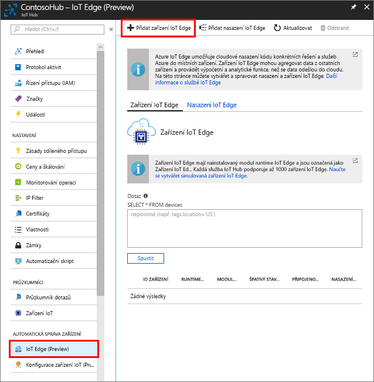

Vytvořte identitu simulovaného zařízení, aby mohla komunikovat s centrem IoT. Zařízení IoT Edge se chovají jinak než typická zařízení IoT a jinak se i spravují, a proto je hned na začátku deklarujete jako zařízení IoT Edge. 

1. Na webu Azure Portal přejděte do svého centra IoT.
1. Vyberte **IoT Edge** a pak vyberte **Přidat zařízení IoT Edge**.

   

1. Zadejte jedinečné ID zařízení pro vaše simulované zařízení.
1. Výběrem **Uložit** přidejte své zařízení.
1. V seznamu zařízení vyberte své nové zařízení.
1. Zkopírujte hodnotu **Připojovací řetězec – primární klíč** a uložte ji. Tuto hodnotu použijete ke konfiguraci modulu runtime IoT Edge v další části. 

