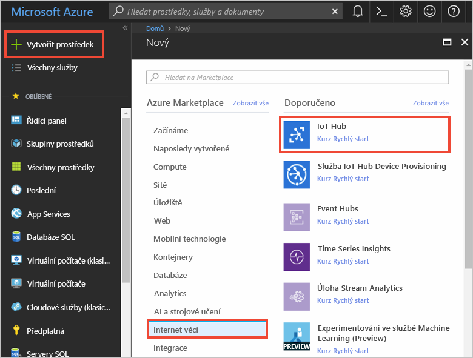
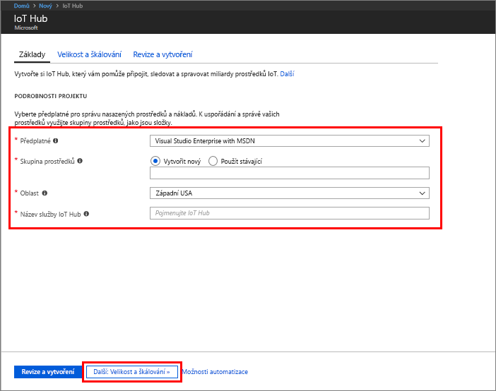
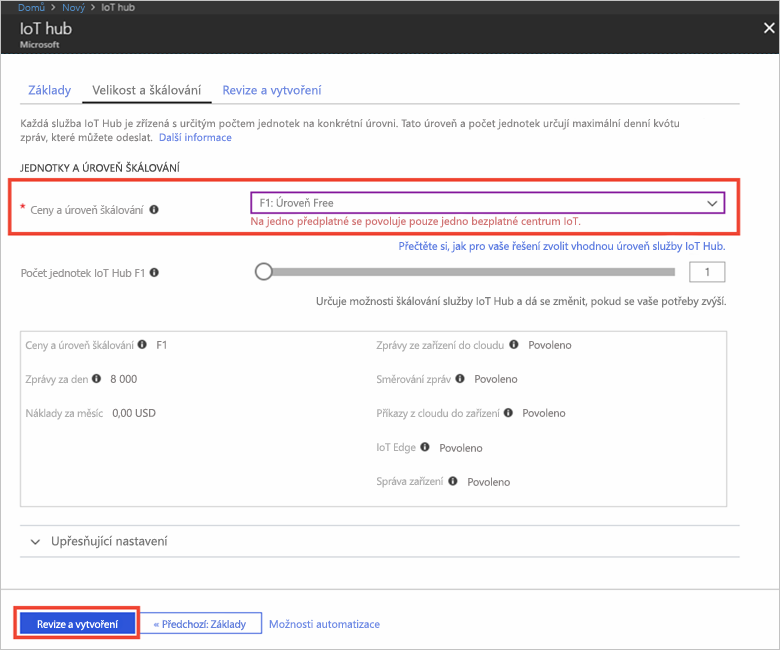

1. Přihlaste se k webu [Azure Portal](https://portal.azure.com/).

2. Vyberte **Vytvořit prostředek** > **Internet věcí** > **IoT Hub**.
   
    

3. V podokně **Centrum IoT** zadejte následující informace o centru IoT:

   * **Předplatné:** Vyberte předplatné, které chcete použít při vytváření tohoto centra IoT Hub.

   * **Skupina prostředků:** Vytvořte skupinu prostředků, která bude hostitelem centra IoT, nebo použijte existující. Další informace najdete v tématu [Použití skupin prostředků ke správě prostředků Azure](../articles/azure-resource-manager/resource-group-portal.md).

   * **Oblast:** Vyberte umístění, které je vám nejbližší.

   * **Název:** Vytvořte název centra IoT. Pokud je zadaný název platný, zobrazí se zelený symbol zaškrtnutí.

   [!INCLUDE [iot-hub-pii-note-naming-hub](iot-hub-pii-note-naming-hub.md)]

   

4. Pokračujte ve vytváření centra IoT Hub výběrem možnosti **Další: Velikost a škálování**. 

5. Zvolte si **Úroveň ceny a škálování**. Pro potřeby tohoto článku vyberte úroveň **F1 – Free**, pokud je ve vašem předplatném ještě dostupná. Další informace najdete v tématu popisujícím [úrovně cen a škálování](https://azure.microsoft.com/pricing/details/iot-hub/).

   

6. Vyberte **Zkontrolovat a vytvořit**.

7. Zkontrolujte informace o centru IoT Hub a potom klikněte na **Vytvořit**. Vytvoření centra IoT může trvat několik minut. Průběh můžete sledovat v podokně **Oznámení**.