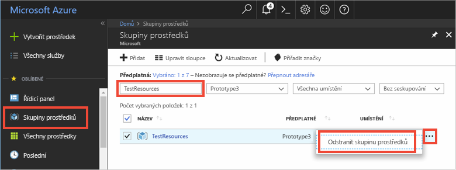

Pokud budete pokračovat k dalšímu doporučenému článku, můžete již vytvořené prostředky zachovat a znovu je použít.

Jinak můžete prostředky Azure vytvořené v tomto článku odstranit a vyhnout se tak poplatkům. 

> [!IMPORTANT]
> Odstranění skupiny prostředků je nevratné. Skupina prostředků i všechny prostředky v ní obsažené se trvale odstraní. Ujistěte se, že nechtěně neodstraníte nesprávnou skupinu prostředků nebo prostředky. Pokud jste službu IoT Hub vytvořili uvnitř existující skupiny prostředků obsahující prostředky, které chcete zachovat, odstraňte místo skupiny prostředků pouze samotný prostředek služby IoT.
>

Odstranění skupiny prostředků podle názvu:

1. Přihlaste se na web [Azure Portal ](https://portal.azure.com) a klikněte na **Skupiny prostředků**.

2. Do textového pole **Filtrovat podle názvu...** zadejte název skupiny prostředků obsahující vaši službu IoT Hub. 

3. V seznamu výsledků klikněte na **...** napravo od vaší skupiny prostředků a pak na **Odstranit skupinu prostředků**.

    

4. Zobrazí se výzva k potvrzení odstranění skupiny prostředků. Potvrďte odstranění tím, že znovu zadáte název vaší skupiny prostředků, a pak klikněte na **Odstranit**. Po chvíli bude skupina prostředků včetně všech obsažených prostředků odstraněná.