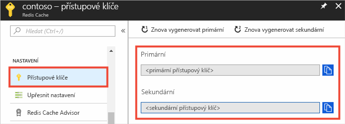
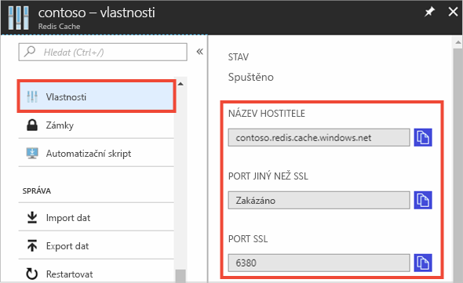

### Načtení názvu hostitele, portů a přístupových klíčů pomocí webu Azure Portal

Při připojení k instanci Azure Redis Cache potřebují klienti mezipaměti název hostitele, porty a klíč pro tuto mezipaměť. Někteří klienti můžou tyto položky označovat trochu odlišnými názvy. Tyto informace lze načíst na webu Azure Portal.

Pokud chcete načíst přístupové klíče pomocí webu [Azure Portal](https://portal.azure.com), přejděte k mezipaměti a klikněte na **Přístupové klíče**. 

Pokud chcete načíst název hostitele a porty, klikněte na **Vlastnosti**.

