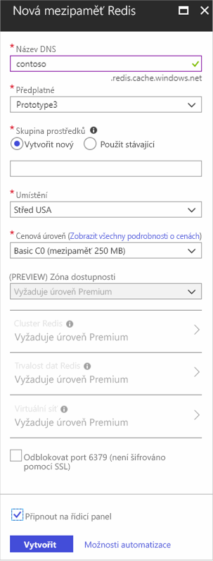
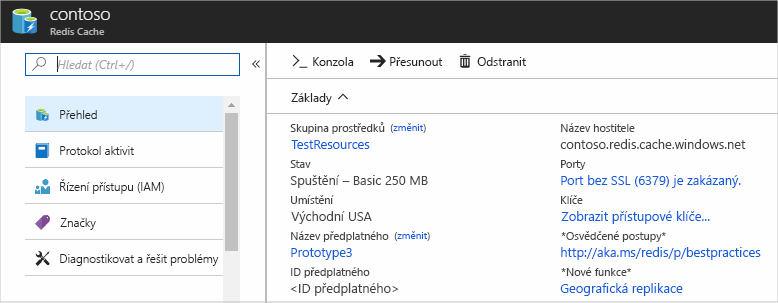

1. Pokud chcete vytvořit mezipaměť, přihlaste se nejdříve k webu [Azure Portal](https://portal.azure.com). Potom vyberte **vytvořit prostředek** > **databází** > **mezipaměti Azure Redis**.

    

2. V **nové mezipaměti Redis Azure**, nakonfigurujte nastavení pro novou mezipaměť.

    | Nastavení      | Navrhovaná hodnota  | Popis |
    | ------------ |  ------- | -------------------------------------------------- |
    | **Název DNS** | Globálně jedinečný název | Název mezipaměti. Musí to být řetězec o délce 1 až 63 znaků a smí obsahovat jenom čísla, písmena a znak `-`. Název mezipaměti nesmí začínat ani končit znakem `-` a po sobě jdoucí znaky `-` nejsou platné.  | 
    | **Předplatné** | Vaše předplatné | Předplatné, ve kterém se vytvoří tuto novou mezipaměť Azure Redis instance v Azure. | 
    | **Skupina prostředků** |  *TestResources* | Název nové skupiny prostředků, ve které chcete vytvořit mezipaměť. Když umístíte všechny prostředky pro aplikaci do skupiny, můžete je spravovat společně. Odstraněním příslušné skupiny prostředků se například odstraní všechny prostředky, které jsou přidružené k dané aplikaci. | 
    | **Umístění** | USA – východ | Zvolte [oblast](https://azure.microsoft.com/regions/) v blízkosti jiných služeb, které budou používat danou mezipaměť. |
    | **[Cenová úroveň](https://azure.microsoft.com/pricing/details/cache/)** |  Basic C0 (mezipaměť 250 MB) |  Cenová úroveň určuje velikost, výkon a funkce, které jsou k dispozici pro danou mezipaměť. Další informace najdete v tématu [Azure mezipaměti Azure redis Cache přehled](../articles/azure-cache-for-redis/cache-overview.md). |
    | **Připnout na řídicí panel** |  Vybrané | Připněte novou mezipaměť na řídicí panel, aby ji bylo možné snadno najít. |

     

3. Po dokončení konfigurace nastavení nové mezipaměti vyberte **Vytvořit**. 

    Vytvoření mezipaměti může několik minut trvat. Pokud chcete zkontrolovat stav, můžete průběh sledovat na řídicím panelu. Po vytvoření je nová mezipaměť ve stavu **Spuštěno** a je připravená k použití.

    

