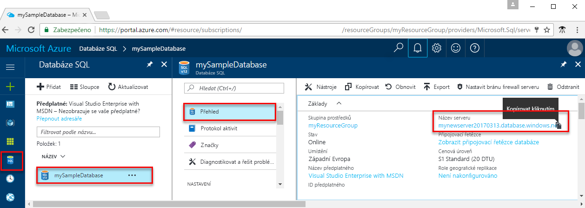

<!-- sql-database-connect-query-prerequisites-server-connection-info-includes.md 

## Get SQL server connection information
-->

Získejte informace o připojení potřebné pro připojení k databázi Azure SQL. Nadcházející postupy budete potřebovat plně kvalifikovaný název serveru, název databáze a přihlašovací údaje.

1. Přihlaste se k webu [Azure Portal](https://portal.azure.com/).

1. Vyberte **databází SQL** v levé nabídce pak vyberte vaši databázi na **databází SQL** stránky.

1. Na **přehled** stránce pro vaši databázi si prohlédněte plně kvalifikovaný název vedle položky **název serveru**. Zkopírujte název serveru, je ukazatel myši a vyberte **kopírování** ikonu.  

Pokud zapomenete přihlašovací údaje, vyberte název serveru otevřete **systému SQL server** stránky. Tady si můžete zobrazit **správce serveru** název a vyberte **resetovat heslo** v případě potřeby.