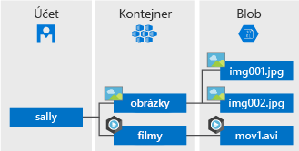

Azure Blob Storage je řešení úložiště objektů Microsoftu pro cloud. Blob Storage je optimalizované pro ukládání velkých objemů nestrukturovaných dat, jako jsou textová nebo binární data.

Blob Storage je ideální pro:

* Poskytování obrázků nebo dokumentů přímo do prohlížeče
* Ukládání souborů pro distribuovaný přístup
* Streamování videa a zvuku
* Zápis do souborů protokolů
* Ukládání dat pro zálohování a obnovování, zotavení po havárii a pro archivaci
* Ukládání dat, které bude analyzovat místní nebo v Azure hostovaná služba

Uživatelé nebo klientské aplikace mohou získat přístup k objektům blob Storage přes HTTP nebo HTTPS z libovolného místa na světě, a to prostřednictvím adres URL, [rozhraní REST API služby Azure Storage](https://docs.microsoft.com/rest/api/storageservices/blob-service-rest-api), [Azure PowerShellu](https://docs.microsoft.com/powershell/module/azure.storage), [Azure CLI](https://docs.microsoft.com/cli/azure/storage) nebo klientské knihovny služby Azure Storage. Klientské knihovny úložiště jsou dostupné pro řadu jazyků, mezi které patří [.NET](https://docs.microsoft.com/dotnet/api/overview/azure/storage/client), [Java](https://docs.microsoft.com/java/api/overview/azure/storage/client), [Node.js](http://azure.github.io/azure-storage-node), [Python](https://docs.microsoft.com/python/azure/), [PHP](http://azure.github.io/azure-storage-php/) a [Ruby](http://azure.github.io/azure-storage-ruby).

## Koncepty služby Blob service

Blob Storage zveřejňuje tři prostředky: váš účet úložiště, kontejnery v účtu a objekty blob v kontejneru. Na následujícím diagramu jsou vztahy těchto prostředků.

### Účet úložiště

Veškerý přístup k datovým objektům v Azure Storage se děje přes účet úložiště. Další informace najdete v tématu [Přehled účtu Azure Storage](../articles/storage/common/storage-account-overview.md?toc=%2fazure%2fstorage%2fblobs%2ftoc.json).

### Kontejner

Kontejner slouží k uspořádání sady objektů blob podobně, jako se používá složka v systému souborů. Všechny objekty blob jsou v kontejneru. Účet úložiště může zahrnovat neomezený počet kontejnerů a v každém kontejneru může být neomezený počet objektů blob. 

  > [!NOTE]
  > Názvy kontejnerů musí obsahovat jenom malá písmena.

### Objekt blob
 
Azure Storage nabízí tři typy objektů blob: objekty blob bloku, doplňovací objekty blob a [objekt blob stránky](../articles/storage/blobs/storage-blob-pageblob-overview.md) (používané jako soubory VHD).

* V objektech blob bloku může být uložený text a binární data až do velikosti přibližně 4,7 TB. Objekty blob bloku se skládají z bloků dat, které můžete spravovat jednotlivě.
* Doplňovací objekty blob jsou složené z bloků podobně jako objekty blob bloku, ale jsou optimalizované pro připojovací operace. Doplňovací objekty blob jsou ideální pro scénáře, jako je protokolování dat z virtuálních počítačů.
* Do objektů blob stránky se ukládají soubory s náhodným přístupem až do velikosti 8 TB. V objektech blob stránky jsou uložené soubory VHD, které se používají k zálohování virtuálních počítačů.

Všechny objekty blob jsou v kontejneru. Kontejner se podobá složce v systému souborů. Objekty blob můžete dál uspořádat do virtuálních adresářů a procházet je stejně jako systém souborů. 

Velké datové sady a síťová omezení v některých případech znamenají, že nahrávání dat do služby Blob Storage přes síť je nerealistické. Můžete využít [Azure Data Box Disk](../articles/databox/data-box-disk-overview.md) a vyžádat si od Microsoftu jednotky SSD (solid-state drive). Potom můžete data zkopírovat na tyto disky a odeslat je do Microsoftu, aby se nahrála do služby Blob Storage.

Pokud potřebujete z vašeho účtu úložiště exportovat velké objemy dat, přečtete si článek o [použití služby Microsoft Azure Import/Export k přenosu dat do služby Blob Storage](../articles/storage/common/storage-import-export-service.md).
  
Podrobnosti o vytváření názvů kontejnerů a objektů blob najdete v článku [Názvy kontejnerů, objektů blob a metadat a odkazování na ně](/rest/api/storageservices/Naming-and-Referencing-Containers--Blobs--and-Metadata).
