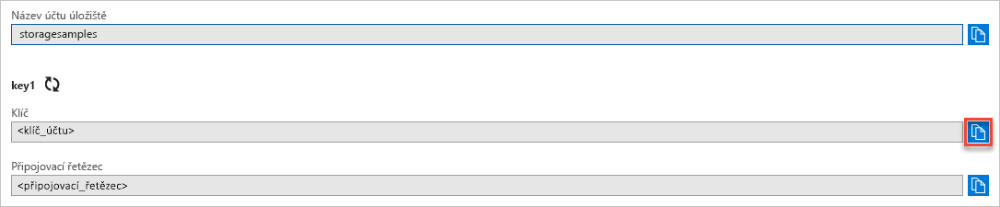

## Zkopírování přihlašovacích údajů z webu Azure Portal

Ukázková aplikace potřebuje ověřit přístup k vašemu účtu úložiště. Ověření provedete tak, že aplikaci poskytnete přihlašovací údaje svého účtu úložiště v podobě připojovacího řetězce. Zobrazení přihlašovacích údajů účtu úložiště:

1. Přejděte na [Azure Portal](https://portal.azure.com).
2. Vyhledejte svůj účet úložiště.
3. V části **Nastavení** v přehledu účtu úložiště vyberte **Přístupové klíče**. Zobrazí se přístupové klíče vašeho účtu a také úplný připojovací řetězec pro jednotlivé klíče.
4. Poznamenejte si název svého účtu úložiště, který budete muset zadat k ověření.   
5. V části **key1** vyhledejte hodnotu **Klíč** a kliknutím na tlačítko **Kopírovat** zkopírujte klíč účtu.

    
