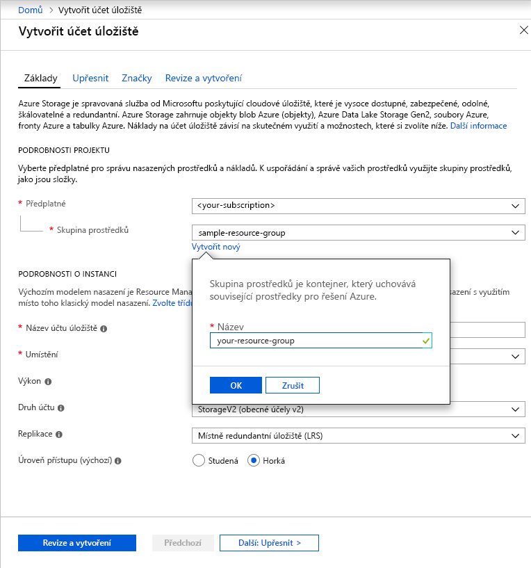

Pokud chcete vytvořit účet úložiště pro obecné účely verze 2 na webu Azure Portal, postupujte takto:

1. Na webu Azure Portal vyberte **Všechny služby**. V seznamu prostředků zadejte **Účty úložiště**. Seznam se průběžně filtruje podle zadávaného textu. Vyberte **Účty úložiště**.
1. V okně **Účty úložiště**, které se zobrazí, zvolte **Přidat**.
1. Vyberte předplatné, ve kterém chcete vytvořit účet úložiště.
1. Pod polem **Skupina prostředků** vyberte **Vytvořit novou**. Zadejte název nové skupiny prostředků, jak je znázorněno na následujícím obrázku.

    

1. Dále zadejte název účtu úložiště. Zvolený název musí být jedinečný v rámci Azure. Název také musí mít délku 3 až 24 znaků a může obsahovat jenom číslice a malá písmena.
1. Vyberte pro svůj účet úložiště nějaké umístění nebo použijte výchozí umístění.
1. Tato pole nechte nastavená na výchozí hodnoty:

   |Pole  |Hodnota  |
   |---------|---------|
   |Model nasazení     |Resource Manager         |
   |Výkon     |Standard         |
   |Account kind (Druh účtu)     |StorageV2 (obecné účely v2)         |
   |Replikace     |Místně redundantní úložiště (LRS)         |
   |Access tier (Vrstva přístupu)     |Hot         |

1. Vyberte **Zkontrolovat a vytvořit**, zkontrolujte nastavení účtu úložiště a vytvořte účet.
1. Vyberte **Vytvořit**.

Další informace o typech účtů úložiště a dalším nastavení účtu úložiště najdete v článku s [přehledem účtu Azure Storage](https://docs.microsoft.com/azure/storage/common/storage-account-overview). Další informace o skupinách prostředků najdete v článku [Přehled Azure Resource Manageru](https://docs.microsoft.com/azure/azure-resource-manager/resource-group-overview). 
